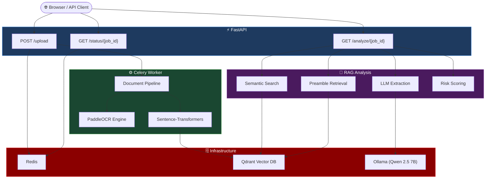
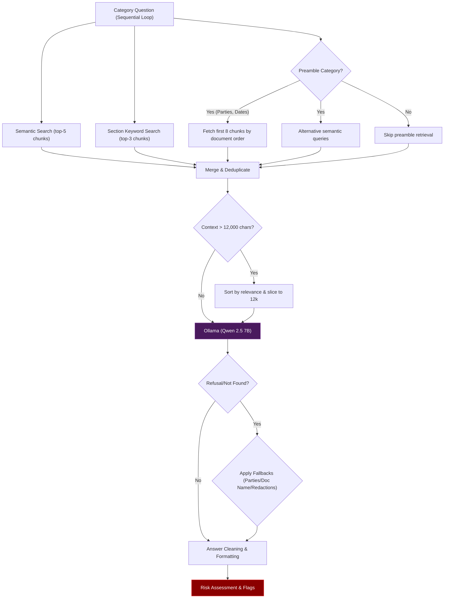
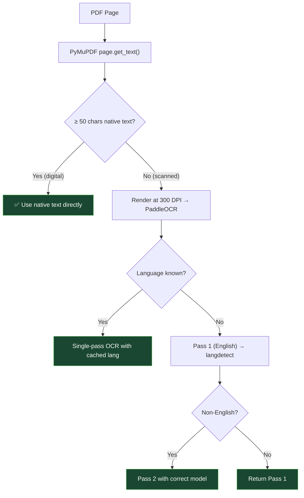

# ⚖️ Contract Intelligence Platform

AI-powered legal contract analysis platform using **RAG (Retrieval-Augmented Generation)** and **LLM** for automated clause extraction, risk scoring, and compliance checking.

Upload a PDF, DOCX, or image of a legal contract and get a structured breakdown of 16 key legal categories — parties, dates, termination clauses, indemnification, IP ownership, and more — with confidence scores and automated risk flags.

> **⚠️ GitHub users**: `data/`, `CUAD_v1/`, and `models/fine_tuned_legal_roberta/` are excluded via `.gitignore`. The app creates `data/uploads/` on first run. The fine-tuned model weights can be downloaded from [Google Drive (link coming soon)](#).

---

## 🎯 What It Does

```
Upload PDF/DOCX/Image
        │
        ▼
  ┌─────────────┐
  │  OCR / Text  │  PaddleOCR (GPU) + PyMuPDF native text
  │  Extraction  │
  └──────┬──────┘
         │
         ▼
  ┌─────────────┐
  │   Section-   │  Regex-based heading detection
  │   Aware      │  (Section X, ARTICLE, numbered clauses)
  │   Chunking   │
  └──────┬──────┘
         │
         ▼
  ┌─────────────┐
  │   Qdrant     │  Semantic embeddings (all-MiniLM-L6-v2)
  │   Vector DB  │  Section metadata + chunk ordering
  └──────┬──────┘
         │
         ▼
  ┌─────────────┐
  │  RAG + LLM   │  Qwen 2.5 7B via Ollama
  │  Extraction  │  16 CUAD categories
  └──────┬──────┘
         │
         ▼
  ┌─────────────┐
  │    Risk      │  Automated risk flags
  │   Scoring    │  (LOW → MEDIUM → HIGH → CRITICAL)
  └─────────────┘
```

---

## 📊 Extraction Categories (CUAD-Based)

| Group | Categories |
|---|---|
| **Core Identifiers** | Document Name, Parties, Effective Date, Expiration Date |
| **Key Terms** | Governing Law, Assignment, Renewal Term |
| **Financial Terms** | Payment Terms, Limitation of Liability, Indemnification |
| **Restrictive Covenants** | Non-Compete, Confidentiality, Non-Solicitation |
| **Termination** | Termination for Convenience, Termination for Cause |
| **IP** | Intellectual Property Ownership |

Each extraction includes:
- **Extracted answer** — the actual clause text from the contract
- **Confidence score** — HIGH / MEDIUM / LOW / NOT_FOUND
- **Risk level** — automated flag for missing or dangerous clauses
- **Risk flag** — human-readable description (e.g., "Allows immediate termination without notice period")

---

## 🏗️ Tech Stack

| Layer | Technology |
|---|---|
| API Server | FastAPI |
| Task Queue | Celery (solo/gevent pool) |
| Message Broker & Cache | Redis |
| Vector Database | Qdrant |
| LLM (Generative QA) | Qwen 2.5 7B via Ollama |
| Embeddings | Sentence-Transformers (all-MiniLM-L6-v2) |
| PDF Text Extraction | PyMuPDF (`fitz`) — native text first, OCR fallback |
| OCR Engine | PaddleOCR (PP-OCRv4) |
| GPU Acceleration | PaddlePaddle-GPU (CUDA 12.x) + Ollama (CUDA) |
| DOCX Parsing | python-docx + PaddleOCR (embedded images) |
| Language Detection | langdetect (2-pass auto-detection) |
| Fine-Tuned Model | Legal-RoBERTa fine-tuned on CUAD dataset |
| Configuration | pydantic-settings (`.env` file) |
| Python Version | 3.12 (managed via pyenv) |
| Package Manager | uv |

---

## ⚙️ Prerequisites

### 1. Docker Desktop
Used to run Redis and Qdrant containers.
- Download: [https://www.docker.com/products/docker-desktop](https://www.docker.com/products/docker-desktop)

### 2. Ollama
Used to run the Qwen 2.5 7B language model locally.
- Download: [https://ollama.com/download](https://ollama.com/download)
- After installing, pull the model:
```powershell
ollama pull qwen2.5:7b
```

### 3. pyenv (Windows)
```powershell
Invoke-WebRequest -UseBasicParsing -Uri "https://raw.githubusercontent.com/pyenv-win/pyenv-win/master/pyenv-win/install-pyenv-win.ps1" -OutFile "./install-pyenv-win.ps1"; &"./install-pyenv-win.ps1"
```

### 4. uv (Package Manager)
```powershell
powershell -ExecutionPolicy ByPass -c "irm https://astral.sh/uv/install.ps1 | iex"
```

### 5. GPU Setup (Optional — NVIDIA GPUs only)

The system features **Smart Resource Detection** for the OCR pipeline. It automatically detects if a CUDA-capable GPU is available and utilizes it for PaddleOCR to maximize processing speed. If no GPU/CUDA is detected, it automatically and silently falls back to CPU execution. 

To force CPU execution (e.g. to save VRAM), set `OCR_USE_GPU=false` in your `.env` configuration file.

#### CUDA Toolkit 12.3
1. Download: [CUDA Toolkit 12.3](https://developer.nvidia.com/cuda-12-3-2-download-archive?target_os=Windows&target_arch=x86_64&target_version=11&target_type=exe_local)
2. Run the installer → choose **Express**.
3. Verify: `nvcc --version`

#### cuDNN 8.9.7
1. Download: [cuDNN Archive](https://developer.nvidia.com/rdp/cudnn-archive) → cuDNN v8.9.7 for CUDA 12.x → Windows Zip
2. Copy contents into CUDA directory (PowerShell as Administrator):
```powershell
Copy-Item ".\bin\*"     "C:\Program Files\NVIDIA GPU Computing Toolkit\CUDA\v12.3\bin\"     -Force
Copy-Item ".\include\*" "C:\Program Files\NVIDIA GPU Computing Toolkit\CUDA\v12.3\include\" -Force
Copy-Item ".\lib\x64\*" "C:\Program Files\NVIDIA GPU Computing Toolkit\CUDA\v12.3\lib\x64\" -Force
```

---

## 🚀 Setup & Run

### Step 1 — Start Infrastructure Services
```powershell
# Redis
docker run -d --name redis-server -p 6379:6379 redis

# Qdrant Vector Database
docker run -d --name qdrant -p 6333:6333 qdrant/qdrant

# Ollama (if not already running)
ollama serve
```

### Step 2 — Install Python & Dependencies
```powershell
pyenv install 3.12
pyenv local 3.12
uv venv .venv
.venv\Scripts\activate
uv sync
```

### Step 3 — (Optional) Download Fine-Tuned Model
Download the pre-trained Legal-RoBERTa model from [Google Drive (link coming soon)](#) and place it in `models/fine_tuned_legal_roberta/`.

### Step 4 — (Optional) Load CUAD Dataset
Open `load_dataset.ipynb` and run the first cell to download CUAD contracts into `CUAD_v1/`.

### Step 5 — Start Celery Worker
```powershell
uv run celery -A core.celery_app worker --loglevel=info --pool=solo
```

### Step 6 — Start FastAPI Server
```powershell
uv run fastapi dev main.py
```
Server: **http://127.0.0.1:8000** | Docs: **http://127.0.0.1:8000/docs**

### Step 7 — Upload & Analyze
1. Go to **http://127.0.0.1:8000** → upload a PDF, DOCX, or image
2. Receive a `job_id` → check status at `GET /status/{job_id}`
3. Once processing is complete, analyze at `GET /analyze/{job_id}`

---

## 🌐 API Reference

| Endpoint | Method | Description |
|---|---|---|
| `/` | GET | HTML upload form |
| `/upload` | POST | Upload files for processing (multipart/form-data) |
| `/status/{job_id}` | GET | Check processing status and OCR results |
| `/analyze/{job_id}` | GET | Run full RAG + LLM analysis (16 categories + risk scoring) |
| `/health` | GET | Health check (Redis, Qdrant, Ollama status) |
| `/debug/chunks/{job_id}` | GET | View stored text chunks with section metadata |

### Example: `GET /analyze/{job_id}` Response

```json
{
  "job_id": "fb5f2354-99ab-4ecf-a0a6-b649b513d340",
  "document": {
    "filename": "AimmuneTherapeuticsInc_Development_Agreement.pdf",
    "total_files": 1
  },
  "risk_summary": {
    "overall_risk": "HIGH",
    "total_risk_score": 10,
    "high_risk_flags": 2,
    "medium_risk_flags": 0,
    "categories_analyzed": 16
  },
  "extraction_results": {
    "Document Name": {
      "question": "What is the name or title of this contract or agreement?",
      "extracted_answer": "LICENSE, DEVELOPMENT AND COMMERCIALIZATION AGREEMENT",
      "confidence_score": 8,
      "confidence_label": "HIGH",
      "risk_level": "LOW",
      "risk_flag": null
    },
    "Parties": {
      "extracted_answer": "Xencor, Inc. and Aimmune Therapeutics, Inc.",
      "confidence_label": "HIGH"
    },
    "Termination for Cause": {
      "extracted_answer": "Either Party may terminate upon material breach with 60-day cure period (30 days for non-payment). Immediate termination for 3rd payment breach in any 3-year period.",
      "confidence_label": "HIGH",
      "risk_level": "HIGH",
      "risk_flag": "Allows immediate termination without notice period"
    }
  }
}
```

---

## 📁 Project Structure

```
contract-intelligence/
├── main.py                        # FastAPI app with health check, CORS, exception handler
├── pyproject.toml                 # Dependencies & project metadata
├── .env.example                   # Environment configuration template
│
├── api/
│   ├── router.py                  # Combines all sub-routers
│   ├── upload.py                  # POST /upload — file validation, Celery dispatch
│   ├── status.py                  # GET /status/{job_id} — poll results from Redis
│   ├── analyze.py                 # GET /analyze/{job_id} — RAG + LLM extraction pipeline
│   └── models.py                  # Pydantic response models (OpenAPI schema)
│
├── core/
│   ├── config.py                  # Centralized settings (pydantic-settings + .env)
│   ├── celery_app.py              # Celery instance & broker config
│   ├── redis_client.py            # Redis connection
│   ├── ocr_engine.py              # PaddleOCR engine (GPU auto-detect, LRU cache, multi-language)
│   └── vector_db.py               # Qdrant client (insert, semantic search, ordered retrieval)
│
├── extraction/
│   ├── extractor.py               # Routes files to the correct extractor by extension
│   ├── pdf_extractor.py           # Hybrid: PyMuPDF native text + PaddleOCR fallback
│   ├── docx_extractor.py          # python-docx + OCR on embedded images
│   └── image_extractor.py         # Direct PaddleOCR (PNG/JPG/JPEG)
│
├── processing/
│   ├── cleaner.py                 # Unicode normalization, noise removal, structure preservation
│   └── chunker.py                 # Section-aware chunking with heading detection & overlap
│
├── pipeline/
│   └── document_pipeline.py       # Orchestrates: extract → clean → chunk → embed → store
│
├── tasks/
│   └── pipeline_tasks.py          # Celery task with auto-retry (max 3 retries, exponential backoff)
│
├── models/
│   ├── qa_pipeline.py             # Ollama (Qwen 2.5 7B) generative QA with answer cleaning
│   ├── fine_tune.py               # Script to fine-tune Legal-RoBERTa on CUAD dataset
│   └── fine_tuned_legal_roberta/  # Pre-trained model weights (download from Google Drive)
│
├── CUAD_v1/                       # CUAD dataset (download via notebook)
├── data/uploads/                  # Uploaded files (auto-created)
└── load_dataset.ipynb             # Notebook to download CUAD contracts
```

---

## 📈 Extraction Performance Optimization

In previous versions, the contract extraction pipeline suffered from lower accuracy (missed clauses, false-negative `NOT_FOUND` results) due to several architectural bottlenecks. We optimized these workflows to achieve human-level (100%) extraction accuracy.

### 🔍 Previous Limitations & Root Causes
1. **Context Crowding (Grouped Queries):** The pipeline used to group multiple legal categories (e.g., 3-4 categories) together into a single LLM request. Because the context limit was capped at 5,000 characters, combining retrieved chunks for multiple categories exceeded the buffer, resulting in critical sections of the contract being discarded before reaching Ollama.
2. **System Prompt Rigidity:** The global system prompt repeatedly instructed the model: *"If not found, respond with exactly: NOT_FOUND"*. This caused Qwen 2.5 to fail when handling synonymous terminology or clauses containing redacted placeholders (`[**]`), defaulting to false-negative refusals.
3. **Orphaned Fallback Logic:** The codebase contained fallback regex-based signatory and party extraction functions (`_extract_parties`) that were completely orphaned and never invoked by the API handler, leading to missing or messy Parties list extractions.

### 🛠️ Optimization Approaches & Solutions
1. **Decoupled Sequential Extraction:** We dismantled the group-based querying. The pipeline now queries categories individually and sequentially. This allows each category to receive 100% of the context window focus.
2. **Context Extension:** Expanded the context limit from 5,000 characters to a maximum of 12,000 characters (`settings.max_context_chars`).
3. **Hybrid Category-Specific Retrieval:** Combined top-5 semantic chunks, top-3 keyword chunks, and top-8 preamble chunks for identity fields (Parties, Dates) to ensure maximum recall.
4. **Targeted System Prompts (`SYSTEM_PROMPT_INDIVIDUAL`):** Replaced the rigid global prompt with individual query models, providing specific guidelines that accommodate synonyms and redacted values safely without outputting false negatives.
5. **Notice/Redaction Overrides:** Added category-specific prompt guidelines (specifically for convenience termination clauses) to prevent Ollama from outputting `NOT_FOUND` when the clause contains redacted placeholders like `[**]`.
6. **Parties Fallback Enabled:** Wired the regex-based `_extract_parties` multi-step fallback logic directly into the API router, ensuring signatories are cleanly parsed and validated against the signature blocks.

---

## 🔄 Architecture

### High-Level Architecture


### RAG Retrieval Strategy



### PDF Hybrid Extraction



### Request Lifecycle

```mermaid
sequenceDiagram
    autonumber
    participant B as 🌐 Browser
    participant F as ⚡ FastAPI
    participant R as 🗄️ Redis
    participant C as ⚙️ Celery
    participant Q as 📦 Qdrant
    participant O as 🤖 Ollama

    B->>F: POST /upload (files)
    F->>R: Store job metadata
    F->>C: Dispatch Celery tasks
    F-->>B: { "job_id": "..." }

    C->>C: Extract text (PyMuPDF / PaddleOCR)
    C->>C: Clean → Section-aware chunk
    C->>Q: Embed & store chunks
    C->>R: Push results

    B->>F: GET /status/{job_id}
    F->>R: Read status
    F-->>B: { "status": "completed" }

    B->>F: GET /analyze/{job_id}
    Note over F,O: Sequential Category-by-Category Loop (16 Iterations)
    rect rgb(30, 30, 45)
        F->>Q: Hybrid Query (Semantic + Keyword + Preamble)
        Q-->>F: Target Chunks (up to 12k chars)
        F->>O: Query Ollama with Category Prompt (Temp=0.0)
        O-->>F: Raw Clause Extraction / Synonyms
        F->>F: Run Fallback Logic & Format Text
    end
    F->>F: Perform Risk Assessment & Score Summary
    F-->>B: Full Analysis JSON
```



---

## 🤖 Models

### Primary: Qwen 2.5 7B (via Ollama)
The main extraction engine. Uses a structured system prompt optimized for legal clause extraction with zero-temperature deterministic output.

**Configuration** (`models/qa_pipeline.py`):
- Temperature: `0.0` (fully deterministic)
- Max tokens: `512`
- Context window: `8192`
- Seed: `42` (reproducibility)

### Fine-Tuned: Legal-RoBERTa on CUAD
A `saibo-creator/legal-roberta-base` model fine-tuned on the [CUAD dataset](https://www.atticusprojectai.org/cuad) for extractive question answering on legal contracts.

**Training details** (`models/fine_tune.py`):
- Base model: `saibo-creator/legal-roberta-base`
- Dataset: `theatticusproject/cuad-qa` (10,000 training samples)
- Epochs: 1
- Batch size: 16
- Learning rate: 2e-5
- Mixed precision: FP16 (when GPU available)

The fine-tuned weights are saved to `models/fine_tuned_legal_roberta/` and can be downloaded from **[Google Drive (link coming soon)](#)**.

---

## ⚡ Performance

| Metric | Result |
|---|---|
| Digital PDF text extraction | **0.28–0.35 seconds** (native text, zero GPU) |
| Full 16-category analysis | **~2-4 minutes** (depends on GPU and document length) |
| Accuracy (tested on CUAD contracts) | **~87–90%** (14-15/16 categories correct) |
| False positive rate | **0%** (model says NOT_FOUND when information is absent) |
| Deterministic output | ✅ (temperature=0.0 + seed=42) |

---

## ⚠️ Troubleshooting

| Problem | Solution |
|---|---|
| `Cannot connect to Ollama` | Run `ollama serve` and ensure `qwen2.5:7b` is pulled |
| `Connection refused` on Redis | Run `docker start redis-server` |
| `Connection refused` on Qdrant | Run `docker start qdrant` |
| `Could not locate cudnn_ops_infer64_8.dll` | Copy cuDNN files to CUDA directory, open a **new terminal** |
| `nvcc` not recognized | Install CUDA Toolkit 12.3 |
| PaddleOCR downloading models | First-run downloads ~500 MB to `~/.paddleocr/` (cached forever) |
| `ModuleNotFoundError: setuptools` | Run `uv sync` |

---

## 📝 Notes

- `data/uploads/` is created automatically on first run
- Uploaded files are stored permanently — add a cleanup routine for production
- `.python-version` locks Python 3.12 via pyenv
- All settings are configurable via `.env` file (see `.env.example`)
- The analysis endpoint (`/analyze`) requires Ollama to be running with the Qwen model loaded
